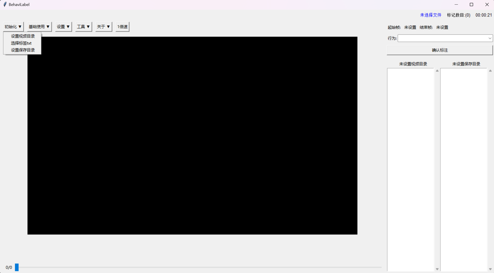
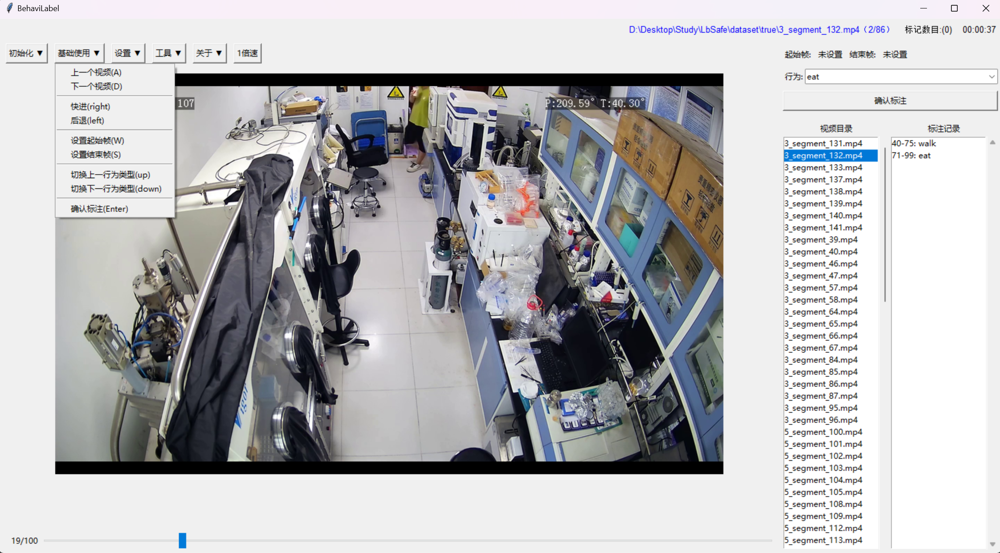
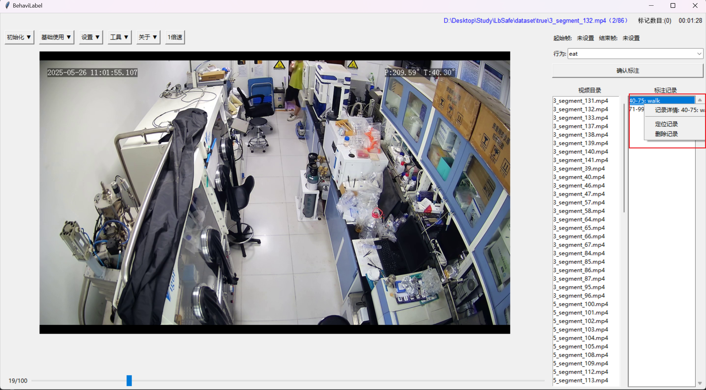
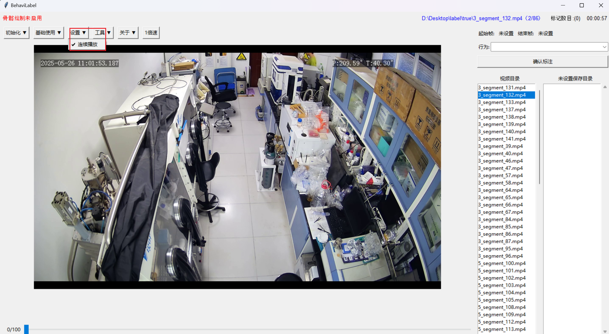
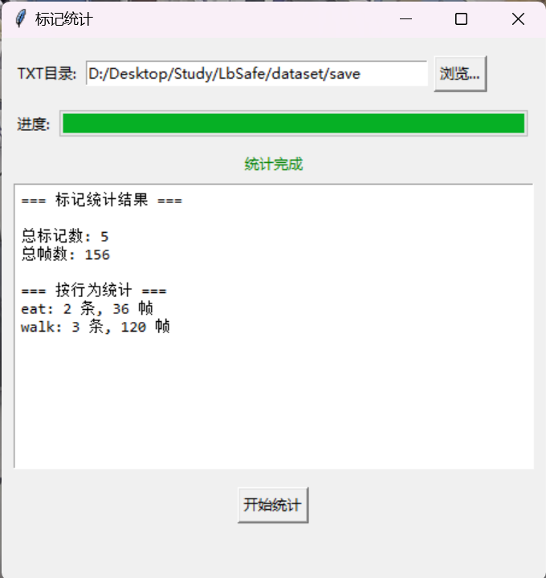
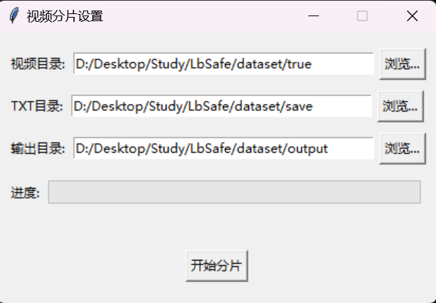
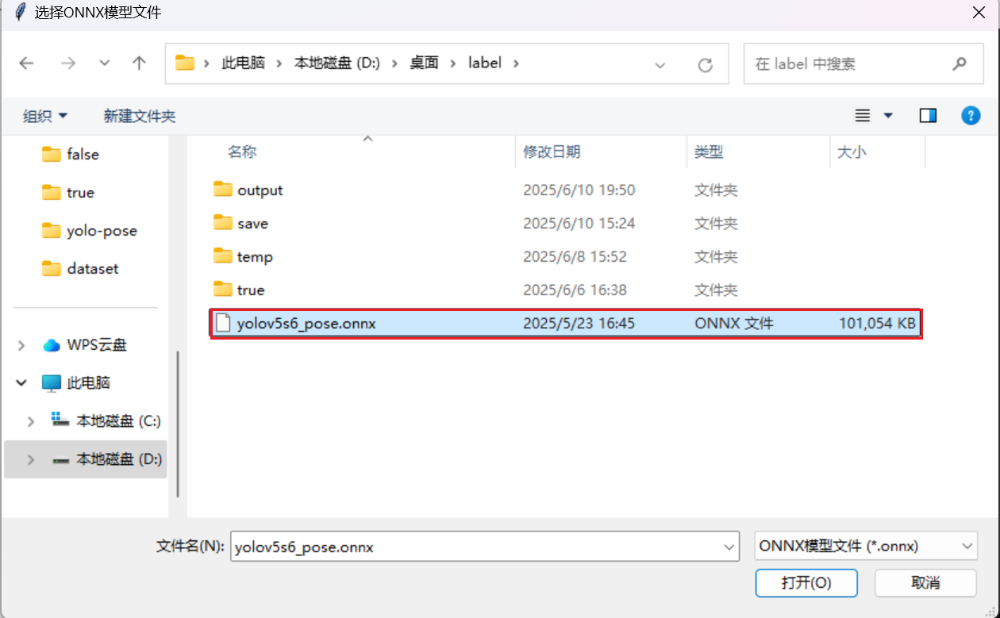
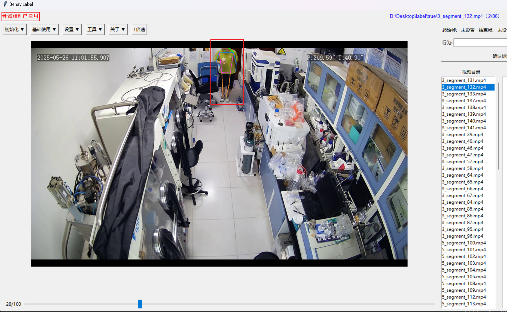
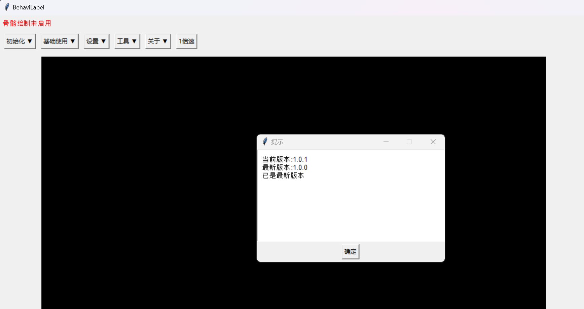

**[View in English](#behavilabel-en) | [查看中文版](#behavilabel-zh)**
##   
# BehaviLabel 🏷️  
[Luofei Wang](https://github.com/wlf728050719)  

**A script for fast video behavior labeling** 🎥

## Quick Start 🚀  

**0.** ⚡ Run the packaged EXE file or execute `python main.py` in a Python environment  
*(Click [here](https://github.com/wlf728050719/BehaviLabel/releases/download/v1.0.0/dist.zip) to download, extract, and run the packaged exe file*, or execute `python main.py` in a Python environment)

**1.** ⚙️ Click the "Initialize" button to set:  
- 📂 Root directory of videos to be labeled  
- 📝 Behavior type TXT file 
- 💾 Label file storage directory 

After setup, the right panel will display all video files and their existing labels.  

  

**2.** 🎮 Use the control buttons to:  
- ↔️ Navigate between videos (A/D)
- ⏩⏪ Fastforward/rewind (right/left)
- 🔄 Switch label types (up/down)
- 🎬 Set start/end frames and confirm labels (W/S)
- 🔍 Use progress bar for quick positioning 

  

**3.** 🖱️ Right-click on existing labels to:  
- 🎯 Jump to the labeled frame 
- ❌ Delete the label  

  

**4.** ✨ Additional features:  
- 🎚️ Multiple playback speed options  
- ⏱️ Work duration timer  
- 📊 Label count display 

## Setting ⚙️

Supports automatic playback to help work more efficiently 🔄

  

## Utilities 🛠️  

**1. 📈 Label Statistics**  
View overall labeling statistics 

  

**2. ✂️ Video Clipping**  
Extract video segments based on labels:  
- 📁 Segments with the same behavior are saved in the same subfolder 
- 🔤 Naming format: `[original_name]_[start_frame]_[end_frame]_[behavior].mp4`  

  

**3. 💀 Skeleton Drawing**  
After loading the skeleton keypoint model, you can choose whether to display skeleton information during labeling to help you understand whether the labeled images are valid (Currently only supports the yolopose model, and you can obtain its weights in the release)  

  
  

## Check Update 🔄

Supports checking for updates to use the latest version in a timely manner ⏲️

  

## Future Features 🚧  

1. 📚 History records & language switching  
2. 📊 Direct skeleton node CSV generation 

---

##   
# BehaviLabel 🏷️  
[Luofei Wang](https://github.com/wlf728050719)  

**快速视频行为标注工具** 🎥

## 快速开始 🚀  

**0.** ⚡ 运行打包好的 EXE 文件或在 Python 环境中执行 `python main.py`  
*(点击[此处](https://github.com/wlf728050719/BehaviLabel/releases/download/v1.0.0/dist.zip)下载解压并运行打包好的 exe 文件，或在 Python 环境下执行 `python main.py`)*

**1.** ⚙️ 点击"初始化"按钮设置:  
- 📂 待标注视频根目录  
- 📝 行为类型 TXT 文件  
- 💾 标记文件存放目录  

设置完成后，右侧面板将显示所有视频文件及其现有标签。  

  

**2.** 🎮 使用控制按钮进行：  
- ↔️ 在视频间导航 (A/D)  
- ⏩⏪ 快进/后退 (右箭头/左箭头)  
- 🔄 切换标注类型 (上箭头/下箭头)  
- 🎬 设置起始/结束帧并确认标签 (W/S)  
- 🔍 使用进度条进行快速定位  

  

**3.** 🖱️ 右键单击现有标签以：  
- 🎯 跳转到标注帧  
- ❌ 删除标签  

  

**4.** ✨ 其他功能：  
- 🎚️ 多种播放速度选项  
- ⏱️ 工作时长计时器  
- 📊 标注记录统计  

## 设置 ⚙️

支持自动连播，以帮助更高效的工作 🔄

  

## 工具 🛠️  

**1. 📈 标注统计**  
查看整体标注统计情况  

  

**2. ✂️ 视频切片**  
根据标注记录提取视频片段：  
- 📁 相同行为的片段保存在同一子文件夹中  
- 🔤 命名格式：`[original_name]_[start_frame]_[end_frame]_[behavior].mp4`  

  

**3. 💀 骨骼绘制**  
加载骨骼关键点模型后，可以选择在标注时是否显示骨骼信息，以帮助你了解标注图像是否有效（当前仅支持 yolopose 模型，其权重可以在发布中获得）  

  
  

## 检查更新 🔄

支持检查更新，以及时使用最新版本 ⏲️

  

## 未来功能 🚧  

1. 📚 历史记录与语言切换  
2. 📊 直接生成骨骼节点 CSV 文件
